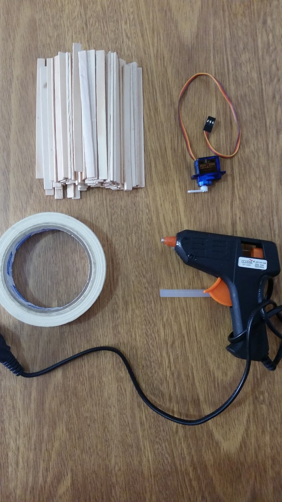
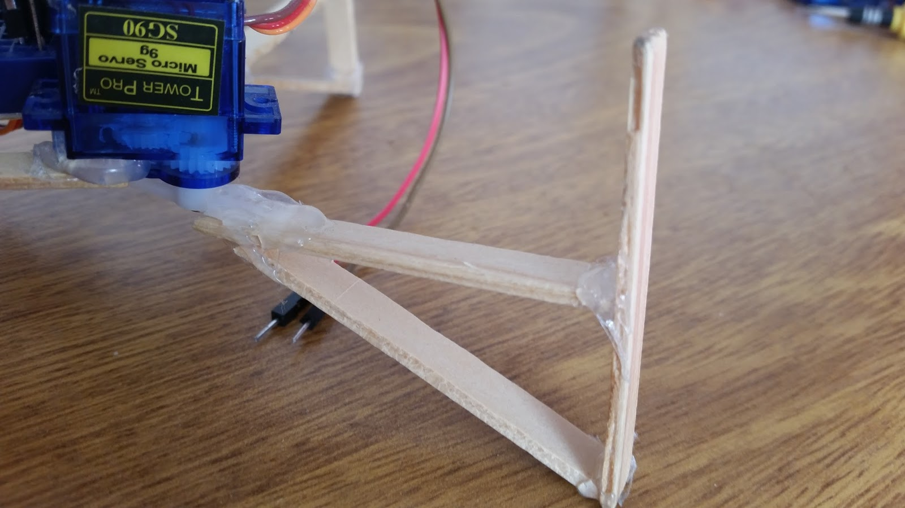
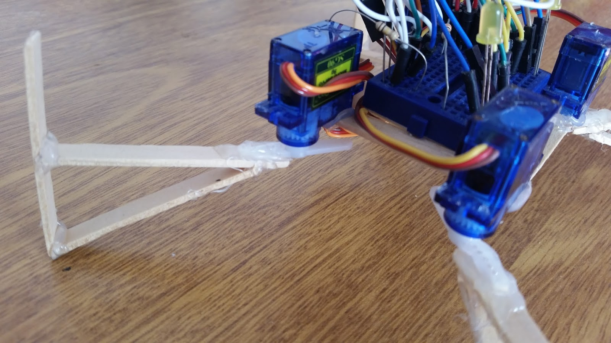
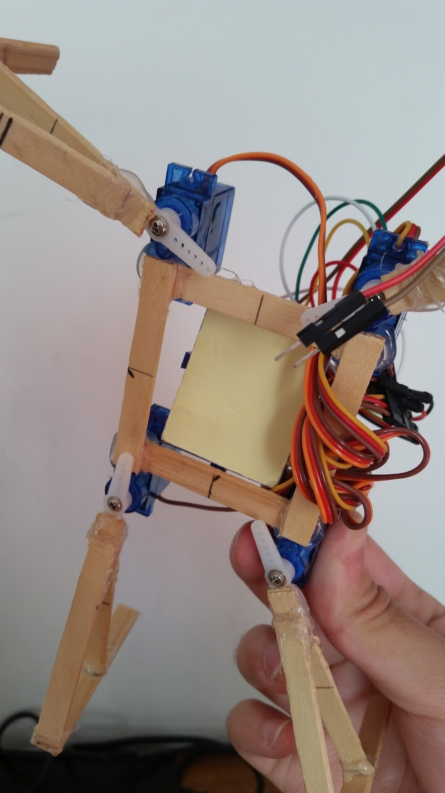
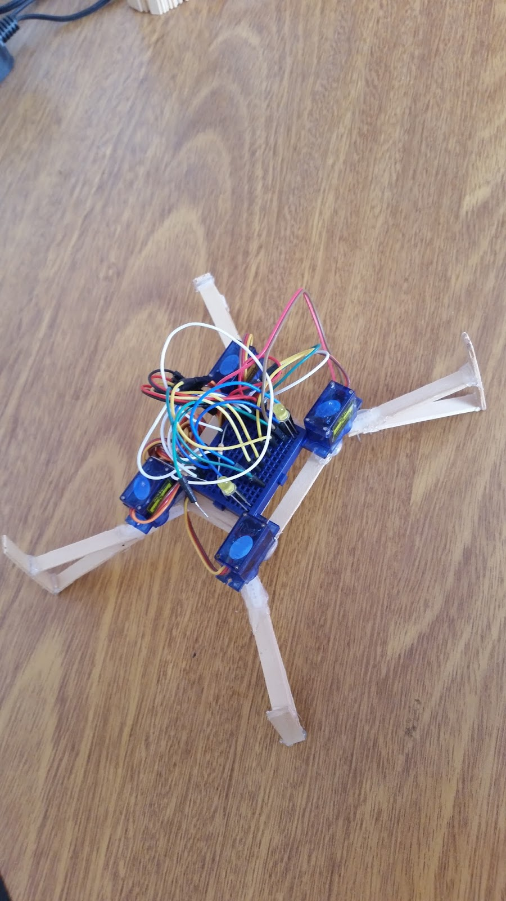
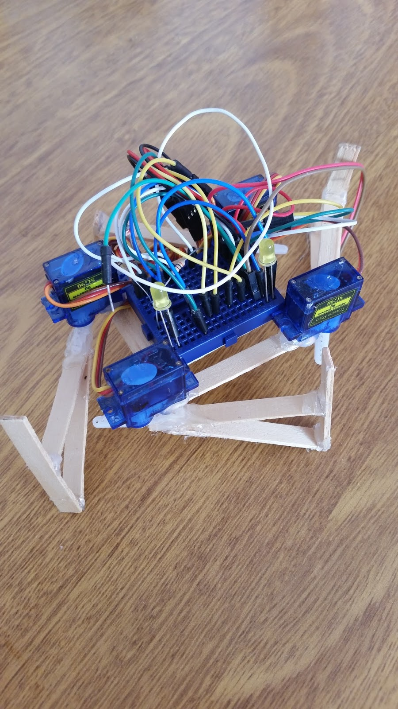
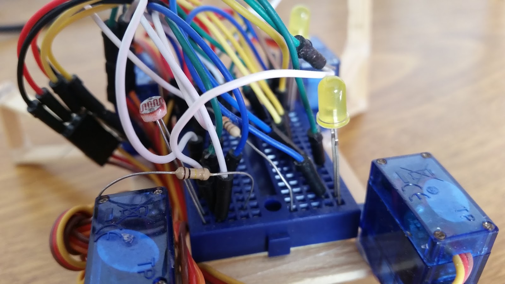
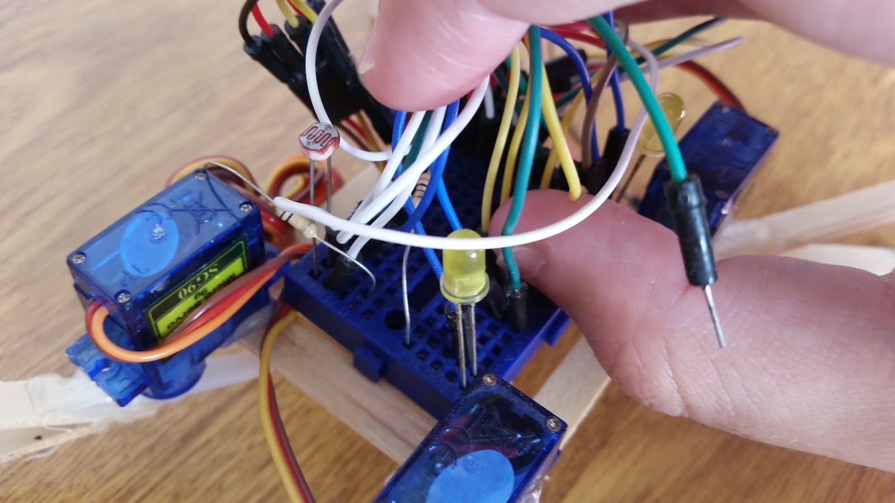

# Crabbie, the educational guy!
### Summary and purpose

* [Introduction](#Introduction)
* [Material](#Material)
* [Assembly](#Assembly)
* [Programming](#Programming)

**Have you ever wondered how expensive is to make a DIY robot?**

An enourmous amount of wires, little electronic components, sensors, actuators and almost always a complex body frame. Not to mention the time spent coding everything from ground up and iterating over bugs in order to accomplish the project objective.

Thinking about all those challanges that not just affect beginners but also veteran researchers, I decided to create this project, to be as simple as possible to make it from scratch, to program, to hack what is already done and specially, to empower any people that wants to innovate using robotics.

# Introduction
"Crabbie" is an extremely cheap robot, that is inspired by actual crabs. The almost minimal number of legs and body size makes the project an ideal candidate for a plethora of uses including:
* Robotic classes (for teens and freshman students)
* Robot kinematics research (as a bio-inspired being)
* Artificial intelligence (using sensors to make the robot learn something by itself)
* Swarm cooperation (even complex artificial intelligence use cases)

**The project can be seen live and running at this [video](https://www.youtube.com/watch?v=InzD8ZbXAwk) on YouTube and high resolution images can be found at the end of this documentation.**

# Material
* **Hot glue pistol**
    * **1x 30 centimeters long** and **8 milimeter thick** glue tube
* **Sticks**
    * **10x** wooden popsicle sticks of **8 centimeter length**
* **Arduino**
    * **1x** Nano/Micro/Mini compatible boards
* **Actuators**
    * **Motors**
        * **4x** 9g SG90 micro servo motors
    * **Lights**
        * **2x** colored LED lights
* **Sensor**
    * **1x** LDR sensor
* **Resistors**
    * **1x 300 omhs** resistor
* **Breadboard/PCB**
    * **1x** Mini breadboard/small PCB of **16 pin sockets at least**
* **Jump wire**
    * **12x 100 milimiter length** jump wire

# Assembly

## Legs
To minimize costs and maximize overall body stability, each leg resemblances an upside down right triangle. Break one wooden popsicle stick into two same size parts, pick another entire stick and finally, glue them togheter enough to make a rigid structure.

When the part has finished drying, glue a servo horn at the 30 degree vertex of the piece as shown in the image below.

> Image references **[#1](#1)**

## Body
The main support frame that sustains all the electronics (and most of the robot weight) can be done breaking two sticks at their half and gluing the four new smaller sticks in order to get a squared shape piece.

When the part has finished drying, glue a servo at each right angle of the frame, making sure that the whole structure is rigid enough.

> Image references **[#2](#2)**

## Putting all togheter

With the whole robot frame structure built, the electronics are all what is left to make the robot alive.

Place the Arduino Mini on the solderless breadboard and put it at the top of the main frame, between the four servos. Use an entire connected line of the breadboard to make the shared GND and another to make the shared VCC of every component. As the current consumption is relatively low in this project, the power can be drawn directly from the Arduino board.

Using the image references and the source code can help to map how the pins should be used and will not be covered in detail because it is kind of a matter of personal decision.

> Image references **[#3](#3)**

# Programming 
It is recommended to use the most updated version of the standard **Arduino IDE** to upload the code into the boards.
The code is maintained in this [Github repository](https://github.com/phtdacosta/crabbie-robot-project) and can still be updated if needed.

Download the `.ino` file and upload it directly to the board. The source code is small and easy to tweak or modify.

### 1.

*Legs*

### 2.

*Body*

### 3.

*Putting all togheter*

## License
The project is totally **open source** under the **MIT license**.